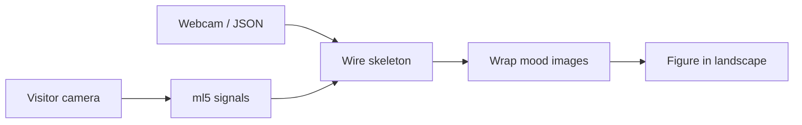

<!-- catalog-mirror: auto -->
# Digital twin — proof of concept

**Studio direction:** [Artwork pipeline](https://mark-walhimer.com/practice/artwork-pipeline.html) · [../STUDIO-DIRECTION.md](../STUDIO-DIRECTION.md)

**Mapping images to emotions** with **Markdown**, **JSON**, **HTML**, **JavaScript + ml5**, and **Cursor**.

Browser pipeline: capture face signals → store as JSON → pair each mood with a straight-ahead PNG → crossfade on keys **1–5**. First step toward **people in landscapes** who react to a visitor’s camera.

| Field | Value |
|-------|--------|
| Series | Digital twin |
| Catalog path | `catalog/digital-twin/` |
| WIP sketches | `sketches/digital-twin/` |
| Sessions + index | `sketches/digital-twin/sessions/` · [`emotion-map.json`](../../sketches/digital-twin/sessions/emotion-map.json) |

## Live URLs

| Page | URL |
|------|-----|
| **Hub** | https://mark-walhimer.com/sketches/digital-twin/index.html |
| **Capture** | https://mark-walhimer.com/sketches/digital-twin/face-signal-study.html |
| **Portrait replay** | https://mark-walhimer.com/sketches/digital-twin/face-signal-portrait-replay.html |
| **Wire replay** | https://mark-walhimer.com/sketches/digital-twin/face-signal-replay.html |
| **Thought replay** | https://mark-walhimer.com/sketches/digital-twin/face-signal-thought-replay.html |
| **Witness Mirror (5s)** | https://mark-walhimer.com/sketches/digital-twin/witness-mirror.html |
| **Witness Mirror (1s)** | https://mark-walhimer.com/sketches/digital-twin/witness-mirror-1s.html |
| **Landscape (next test)** | https://mark-walhimer.com/sketches/invisible-layer/invisible-layer-july-13-2026-landscape.html |

**Video:** ~24s screen recording — portrait replay crossfading neutral → sad → surprise (`digital-twin.mov`)

---

## What this is

| Piece | Role |
|-------|------|
| **Markdown** | This document — POC workflow and direction |
| **JSON** | `emotion-map.json` + session files — emotion → image + motion |
| **HTML** | Self-contained capture and replay pages |
| **JavaScript** | p5.js — draw, WebGL crossfade, UI |
| **ML (ml5.js)** | Face mesh + selfie segmentation (MediaPipe via ml5) |
| **Cursor** | IDE used to build and iterate |

**Two layers (today):** **PNG** = visible face · **JSON** = motion score (no photos inside session JSON)

**Mind layer (POC):** **thought-map.json** + **thoughts/*.json** — DeepFace 7 face words, testimony from 2026-07-30 videos · replay at `face-signal-thought-replay.html`

---

## Emotion → image map

| Key | Emotion | Image | JSON session |
|-----|---------|-------|--------------|
| **1** | neutral | `neutral.png` | `neutral.json` |
| **2** | happy | `happy.png` | `happy.json` |
| **3** | sad | `sad.png` | `sad.json` |
| **4** | think | `think.png` | `think.json` |
| **5** | surprise | `surprise.png` | `surprise.json` |

Straight-ahead frame hints: `mood-anchors.json` in sessions folder.

See [face-signal-study.md](./face-signal-study.md) · [face-signal-portrait-replay.md](./face-signal-portrait-replay.md) · [face-signal-replay.md](./face-signal-replay.md) · [face-signal-thought-replay.md](./face-signal-thought-replay.md) · [witness-mirror.md](./witness-mirror.md) · [witness-mirror-1s.md](./witness-mirror-1s.md).

---

## Pipeline

### Done (POC)

1. **Capture** — webcam + ml5, record labeled JSON, save mood stills
2. **Map** — five PNGs + sessions indexed in `emotion-map.json`
3. **Crossfade replay** — keys 1–5, bottom mood labels
4. **Wire skeleton** — JSON drives wire head (`face-signal-replay.html`); proves geometry, no photo wrap yet
5. **Thought replay** — mood crossfade + `thought-map.json` / `thoughts/*.json` (`face-signal-thought-replay.html`)
6. **Witness Mirror (5s)** — machine witness on testimony video (`witness-mirror.html` + `sessions/witness-mirror-ml.json`)
7. **Witness Mirror (1s)** — same UI, 1-second DeepFace samples (`witness-mirror-1s.html` + `sessions/witness-mirror-ml-1s.json`)

### Next

1. **Landscape test** — place inhabitant (PNG or video billboard) in July-13 walkable landscape
2. **Walking video** — loop of you walking toward camera (`walk-loop.mp4`)
3. **Sidewalk video** — third-person clip from the street (`sidewalk.mp4`)

### Future — skeleton + wrap

**Wire frame = skeleton.** **Images wrapped on skeleton = skinning / rigging.**

- ml5 landmarks (face, later body pose) drive the wire frame
- Mood PNGs (or video patches) bind to that skeleton instead of floating as flat crossfades
- Visitor webcam drives the skeleton → inhabitant **reacts** in the landscape

Crossfade works today because single-photo mesh warp tore. Skeleton + multi-patch wrap is the richer path when one continuous face/body is needed.

---

## Scale to other people

1. **Ask permission** — five photos per person (or one neutral to start)
2. **Capture** — straight-ahead cutouts per mood
3. **Map** — add entry to `emotion-map.json` (or per-person map file)
4. **Place** — figure in landscape
5. **React** — visitor expression → inhabitant crossfade or skeleton wrap

---

## Publish checklist

1. Update this README and `{artwork}.md` in this folder
2. WIP under `sketches/digital-twin/`
3. Register in `sketches/index.html` SERIES
4. `python3 _scripts/reorder_series_by_index_mtime.py`
5. `python3 _scripts/refresh_catalog.py`
6. `python3 _scripts/check_self_contained.py` (full repo, exit 0)

---

## Machine DNA

| Field | Value |
|-------|--------|
| Species | Digital twin |
| Mode | Capture · crossfade replay · (future) skeleton wrap |
| Bodies | browser · ml5 · p5 · Three.js |
