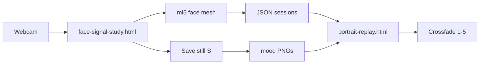

# Digital twin — proof of concept

Mapping **named emotions** to **face images**, driven by **JSON motion recordings** and built with **HTML + JavaScript + ml5** in **Cursor**.

This is the first step toward **inhabitants in empty landscapes** — people who can **react to a visitor’s camera** via machine learning, without needing a full 3D avatar pipeline.

---

## What the proof-of-concept video shows

A ~24-second screen recording of **portrait replay** in the browser:

- One person’s face cut out on a **black background**
- **Five mood labels** along the bottom: neutral · happy · sad · think · surprise
- Pressing **1–5** (or clicking mood buttons) **crossfades** between five straight-ahead PNGs — the same person, different expressions
- A side panel shows **JSON-driven signal bars** (smile, mouth, brow, tilt, yaw) updating as each mood is selected
- No mesh warp, no random playback — just clean image-to-emotion mapping

The video demonstrates that **a still portrait can change expression** when each mood is tied to its own photo, keyed by name and number. That is the seed for placing **real people** (with permission) inside generative landscapes and letting their faces respond to whoever is standing in front of the work.

---

## Where this is going

The workflow scales to **other people**, not just the artist:

1. **Ask permission** — “Can I take five photos of you?” (or one neutral to start)
2. **Capture** — straight-ahead cutouts per mood: neutral, happy, sad, think, surprise
3. **Map** — one PNG + optional JSON session per person, indexed in `emotion-map.json`
4. **Place** — those portraits become **figures in a landscape** (Invisible Layer, walkable terrain, etc.)
5. **React** — the installation reads the **visitor’s webcam** through ml5 face mesh, derives expression signals, and **crossfades the inhabitant’s face** to mirror or echo what the visitor is doing

The visitor’s body stays local (browser ML). The inhabitant’s face is **your photo library**, not a synthetic mask. This POC proves step 4’s face layer works before wiring it into the landscape.

---

## Idea in one sentence

Record face geometry with the webcam → save labeled JSON → pair each mood with one straight-ahead PNG → crossfade between those images on keys **1–5**.

The **image** is what you see. The **JSON** is the motion score underneath (optional for replay bars and scrubbing).

---

## Stack

| Layer | What |
|-------|------|
| **HTML** | `drafts/face-signal-study.html`, `drafts/face-signal-portrait-replay.html` |
| **JavaScript** | p5.js (draw, WebGL crossfade) |
| **ML** | ml5.js — face mesh + selfie segmentation (MediaPipe) |
| **Data** | JSON session files + `emotion-map.json` |
| **Images** | One PNG per mood in `face-signal-sessions/` |
| **Tooling** | Cursor for iteration; `_scripts/clean_face_cutouts.py` for edge cleanup |
| **Serve** | `python3 -m http.server 8080` — camera and fetch require localhost |

---

## Emotion → image map

Source of truth: [`face-signal-sessions/emotion-map.json`](face-signal-sessions/emotion-map.json)

| Key | Emotion | Image (visible) | JSON (motion) |
|-----|---------|-----------------|---------------|
| **1** | neutral | `neutral.png` | `neutral.json` |
| **2** | happy | `happy.png` | `happy.json` |
| **3** | sad | `sad.png` | `sad.json` |
| **4** | think | `think.png` | `think.json` |
| **5** | surprise | `surprise.png` | `surprise.json` |

Straight-ahead frame hints (yaw near center): [`mood-anchors.json`](face-signal-sessions/mood-anchors.json)

---

## JSON schema (session file)

Each `*.json` export from the study page:

```json
{
  "version": 1,
  "note": "Face geometry only — no images.",
  "labels": ["neutral", "happy", "sad", "think", "surprise"],
  "samples": [
    {
      "t": 12359,
      "label": "neutral",
      "signals": {
        "smile": 0.89,
        "mouth": 0.07,
        "brow": 0.57,
        "tilt": 0.50,
        "yaw": 0.49
      },
      "lm": { "1": [0.52, 0.44], "...": "11 landmark points" }
    }
  ]
}
```

**Signals** (0–1, auto-calibrated during recording):

- `smile` — mouth width
- `mouth` — lip open
- `brow` — brow lift
- `tilt` — head roll
- `yaw` — head turn left/right

**Important:** recordings mix expression and head turns. For portrait replay, use **straight-ahead PNGs** per mood — do not warp one photo from yaw-heavy JSON.

---

## Pipeline



### 1. Capture — `face-signal-study.html`

1. Open `http://localhost:8080/drafts/face-signal-study.html`
2. Enable camera
3. **R** — record; **1–5** — label mood while recording
4. **E** — export JSON to Downloads
5. **S** — save still PNG (straight ahead, no head turn)

Move exports into `drafts/face-signal-sessions/`.

### 2. Replay — `face-signal-portrait-replay.html`

1. Open `http://localhost:8080/drafts/face-signal-portrait-replay.html`
2. Mood PNGs load from `face-signal-sessions/` (or **Choose fallback photo…** for neutral)
3. **1–5** — crossfade between mood images
4. Bottom strip shows active emotion label
5. JSON drives optional signal bars + scrub (**Space**, **← →**)

---

## What we tried and dropped

| Approach | Result |
|----------|--------|
| Warp one `neutral.png` from landmark deltas | Cheek bulge, neck warp, mesh tears |
| Signal-driven local warp zones | Better but still unstable on a single photo |
| **5 PNGs + crossfade** | **Works** — proof in `digital-twin.mov` |

---

## File layout

```
drafts/
  digital-twin-poc.md          ← this doc
  face-signal-study.html       ← capture (camera + ml5 + record)
  face-signal-portrait-replay.html  ← replay (crossfade)
  face-signal-replay.html      ← wire-head replay (earlier sketch)
  face-signal-sessions/
    emotion-map.json           ← emotion → image + JSON index
    mood-anchors.json          ← straight-ahead times per mood
    neutral.json … surprise.json
    neutral.png … surprise.png
```

---

## Run locally

```bash
cd /Users/markwalhimer/Documents/GitHub/walhimer.github.io
python3 -m http.server 8080
```

- Study: http://localhost:8080/drafts/face-signal-study.html
- Portrait replay: http://localhost:8080/drafts/face-signal-portrait-replay.html

Hard refresh after edits: **Cmd+Shift+R**.

---

## Next (after this POC)

- **Portrait library** — multiple people, each with their own `emotion-map.json` entry
- **Live camera driver** — visitor expression → crossfade the inhabitant’s mood PNGs in real time
- **Landscape placement** — figures positioned in walkable terrain, reacting as visitors move through the scene
- Cleaner re-record sessions (straight ahead only, no yaw)
