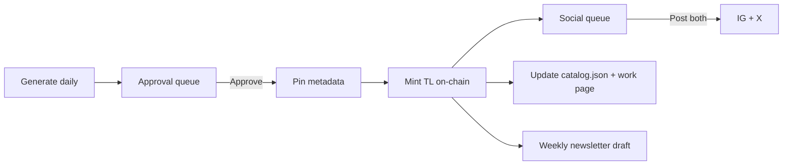

# Program — admin layer (private)

Studio tools behind the public catalog. Design preview in **`markwalhimer-catalog.html`** (Admin ↗ tab). Password-protect in production.

---

## Flow overview

---

## 1. Approval queue

**Input:** Pipeline output (p5 / Three.js / OF) → `drops/YYYY-MM-DD/`

| Field | Example |
|-------|---------|
| Title | Surrender Machines · WS-000088 |
| Generated | Jun 10, 2026 |
| Generator | Three.js |
| Series | Surrender Machines |

**Actions:** Approve → Mint · Reject · Regenerate

On approve: set `status: approved`, queue pin + mint at drop time.

---

## 2. Social post queue

Auto-draft **Post 1** on mint; human edits before publish.

| Action | Behavior |
|--------|----------|
| Post both | IG + X |
| Instagram only | |
| Twitter only | |
| Skip | Log; no post |

Captions from [STYLE-GUIDE.md](STYLE-GUIDE.md). Store in `drops/…/post1.txt` or drop JSON.

**Post 2** (context): manual or weekly batch — not auto on every mint.

---

## 3. Analytics — resonance (v2)

Track per work (optional automation):

| Signal | IG | X |
|--------|----|---|
| Engagement | likes, saves, reach | likes, reposts, impressions |
| Read | “stopped scrolling” | “peer recognition” |

**Action queue** from resonance:

| Tag | Meaning |
|-----|---------|
| Submit competition | High work → [DEADLINES.md](DEADLINES.md) candidate |
| Develop further | Medium → series deepen / object tier |
| Revise | Low → archive or rework |

Manual v1; API integration later (Meta, X analytics).

---

## 4. Newsletter

**Cadence:** Weekly — seven fragments + world paragraph ([STYLE-GUIDE.md](STYLE-GUIDE.md))

| Field | Track |
|-------|-------|
| Subject | e.g. `Seven days — Letting Go · Days 008–014` |
| Sent | date |
| Subscribers | count |
| Opens | % |

**Action:** Draft new newsletter — aggregate last 7 published drops from `drops/`.

Site copy: *“Weekly studio digest — new works, competition news, notes.”* (Not “no frequency promised”.)

---

## 5. Competition tracker

Mirror [DEADLINES.md](DEADLINES.md) with **works preparing**:

| Event | Deadline | Works | Status |
|-------|----------|-------|--------|
| Prix ARS 2027 | Jan 2027 | WS-…, WS-… | In preparation |
| Lumen Prize 2027 | ~May 2027 | TBD | Not started |
| CERN Collide | Monitor late 2026 | Cloud chamber series | Monitoring |

Update when submissions sent — same log as DEADLINES submission table.

---

## 6. Pipeline status (public header)

Admin publishes to site header:

- Last minted date
- Total works in catalog
- Pipeline active (green pulse) when daily system running

---

## Implementation order

1. `drops/` folders + manual approve flag
2. Static admin HTML (local only) reading drop JSON
3. Mint script → updates drop + catalog
4. Social copy generation script
5. Newsletter markdown aggregator
6. Auth gate + hosted admin route (optional subdomain or `/admin/` noindex)

---

## Security

- Never commit private keys
- Admin route: password or wallet allowlist
- Draft previews in `drops/` — gitignore large PNGs if needed; commit JSON + copy only
